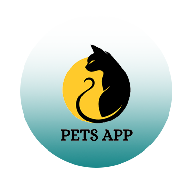

# Pets App



# App Screens


## Table of Contents
- [Introduction](#introduction)
- [Features](#features)
- [Technologies Used](#technologies-used)
- [Setup and Installation](#setup-and-installation)
- [Usage](#usage)
- [Project Structure](#project-structure)
- [Contributing](#contributing)
- [Contact](#contact)
## Introduction
Pets App is a mobile application developed using the Flutter framework. It follows the MVVM architecture pattern and integrates Google Firebase for secure authentication and efficient data storage. The app uses Cubit for state management, ensuring a scalable and maintainable codebase. It offers features such as Cat View, Dog Screen, Explore Screen, and Favorites Screen for a seamless user experience.

## Features
- **Cat View:** Browse and view details of different cats.
- **Dog Screen:** Browse and view details of different dogs.
- **Explore Screen:** Discover various pets and their characteristics.
- **Favorites Screen:** Save and manage your favorite pets for quick access.

## Technologies Used
- **Framework:** Flutter
- **State Management:** Cubit
- **Architecture:** MVVM
- **Backend:** Google Firebase for authentication and data storage
- **APIs:** 
  - [Dogs API](https://thedogapi.com/)
  - [Cats API](https://thecatapi.com/)

## Setup and Installation
To run this project locally, follow these steps:

1. **Clone the repository:**
    ```bash
    git clone https://github.com/your-username/Pets-App.git
    cd Pets-App
    ```

2. **Install dependencies:**
    ```bash
    flutter pub get
    ```

3. **Set up Firebase:**
    - Follow the Firebase setup instructions for Flutter [here](https://firebase.flutter.dev/docs/overview).
    - Download the `google-services.json` file for Android and `GoogleService-Info.plist` for iOS from Firebase console.
    - Place these files in the appropriate directories in your Flutter project.

4. **Run the app:**
    ```bash
    flutter run
    ```

## Usage
To use the Pets App, follow these steps:

1. **Run the app:**
   ```bash
   flutter run
2. **Browse Pets:**
Navigate through the Cat View and Dog Screen to explore various pets.

3. **Search for Pets:**
Use the advanced search functionality to find specific pets.

5. **Favorites:**
Browse meals based on different countries to discover unique recipes and dishes.


## Project Structure
```plaintext
Pets-App/
├── lib/
│   ├── Core/
│   │   ├── errors/
│   │   ├── network/
│   │   ├── shared/
│   │   ├── theme/
│   │   ├── utils/
│   │   └── widgets/
│   ├── Features/
│   │   ├── AuthFeature/
│   │   │   └── presentation/
│   │   ├── BottomNavBar/
│   │   ├── Cats/
│   │   │   ├── data/
│   │   │   └── presentation/
│   │   ├── Dogs/
│   │   │   ├── data/
│   │   │   └── presentation/
│   │   ├── Explore/
│   │   │   ├── data/
│   │   │   └── presentation/
│   │   ├── Favorit/
│   │   │   ├── data/
│   │   │   └── presentation/
│   │   ├── Profile/
│   │   │   ├── data/
│   │   │   └── presentation/
│   │   ├── splash/
│   │       ├── data/
│   │       └── presentation/
│   ├── constants.dart
│   ├── firebase_options.dart
│   └── main.dart
├── test/
├── web/
├── .gitignore
├── pubspec.yaml
└── README.md

```
## Contributing
Contributions are welcome! Please follow these steps:

1. Fork the repository.
2. Create a new branch (git checkout -b feature/your-feature).
3. Commit your changes (git commit -m 'Add some feature').
4. Push to the branch (git push origin feature/your-feature).
5. Open a pull request.
   
## APK Download

You can download the APK file for the Slash App from the following link:

[CookIt App APK Download](https://drive.google.com/file/d/1ksN6pdOfJtrJs-YGpfJ7o_TeD1aZioTW/view?usp=drive_link)

## Contact

For any questions or suggestions, feel free to contact me:

Email: washraf124@gmail.com

LinkedIn: [Waheed Ashraf](https://www.linkedin.com/in/waheed-ashraf-18a197214/)
